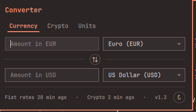

# omarchy-converter

Universal converter widget for the [Omarchy](https://omarchy.org) shell —
currencies, crypto and units, one `⇄` click away in the bar.



## Features

- **Currency** — 166 fiat currencies from [open.er-api.com](https://open.er-api.com),
  no API key
- **Crypto** — 15 major coins from the [CoinGecko](https://www.coingecko.com)
  public API, no API key
- **Units** — length, mass, temperature, volume, area, speed and data size
- **Bidirectional** — type in either field and the other updates live;
  `⇅` swaps the pair, rules flanking it mark the `=` between the two sides
- **Searchable pickers** — filter the 166 currencies by name or code
- **Cross conversion** — any pair on either side (BTC → EUR, CHF → SOL, …)
  through a USD pivot
- **Numpad-friendly** — keypad digits work whatever the numlock state delivers
  (`KP_0`–`KP_9`, or navigation keysyms tagged with the keypad modifier)
- **Offline-tolerant** — rates are cached on disk (6 h fiat, 10 min crypto);
  a stale cache still converts, with an age badge in the footer
- **Keyboard-first** — the amount field takes focus when the panel opens;
  `Esc` closes

## Install

```
omarchy plugin add https://github.com/dguillerm/omarchy-converter.git --enable --yes
```

Or by hand:

```
git clone https://github.com/dguillerm/omarchy-converter.git \
  ~/.config/omarchy/plugins/dguillerm.omarchy-converter
omarchy-shell shell rescanPlugins
omarchy plugin enable dguillerm.omarchy-converter
```

The `⇄` widget lands in the center bar section; move it with
`omarchy bar move dguillerm.omarchy-converter --section right`.

> **Note:** hot reload does not propagate to mounted bar widgets — run
> `omarchy restart shell` after changing the code.

## Usage

Click the `⇄` bar icon (left click toggles the panel, right click forces a
rate refresh). Pick a tab:

| Tab | Converts |
|-----|----------|
| **Currency** | any fiat pair |
| **Crypto** | crypto ↔ crypto and crypto ↔ fiat |
| **Units** | length, mass, temperature, volume, area, speed, data |

Type in the top or the bottom field — the other side follows. The footer shows
the age of both rate sources.

## Settings

Per-widget settings live inline in `~/.config/omarchy/shell.json`, on the
widget's layout entry:

```json
{
  "id": "dguillerm.omarchy-converter",
  "defaultCurrencyFrom": "EUR",
  "defaultCurrencyTo": "USD",
  "cryptoIds": "bitcoin,ethereum,solana"
}
```

| Key | Default | Description |
|-----|---------|-------------|
| `defaultCurrencyFrom` | `EUR` | Source currency on first open |
| `defaultCurrencyTo` | `USD` | Target currency on first open |
| `cryptoIds` | 15 majors | Comma-separated [CoinGecko](https://www.coingecko.com) ids |

## Requirements

Omarchy's shell (Quickshell) plus `curl` and `jq` — all ship with Omarchy.

## How it works

```
manifest.json            plugin manifest (bar-widget kind)
BarWidget.qml            bar icon + rate fetching (Quickshell Process)
Panel.qml                popup: tabs, bidirectional editors, pickers
Model.js                 unit tables + USD-pivot rate math (plain JS, node-testable)
scripts/fetch-rates      open.er-api.com fetch with disk cache
scripts/fetch-crypto     CoinGecko fetch with disk cache
```

Rates cache lives in `~/.cache/omarchy/converter/`. Conversion through the USD
pivot: any value → USD → target, so every fiat/fiat, crypto/fiat and
crypto/crypto pair shares one code path (`Model.convertCross`).

## License

[MIT](LICENSE)
